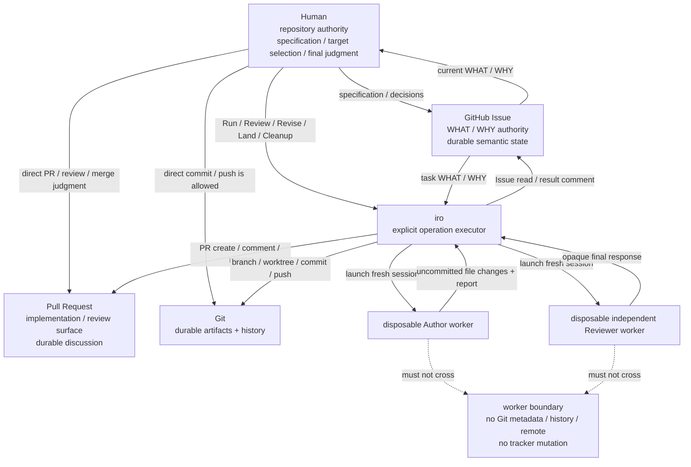
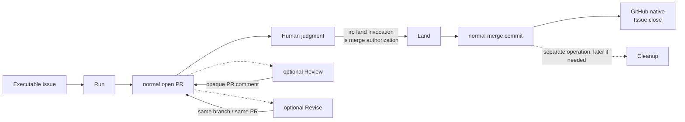
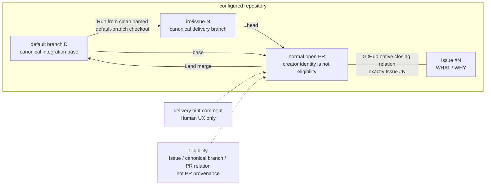
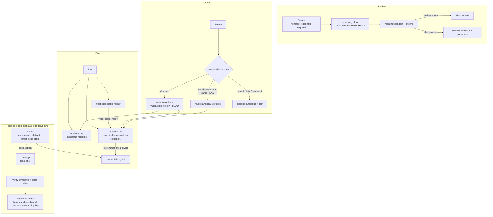
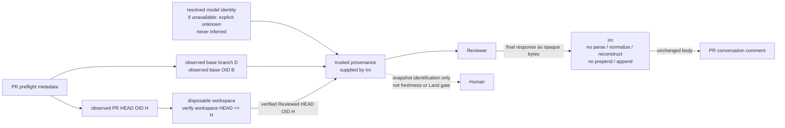
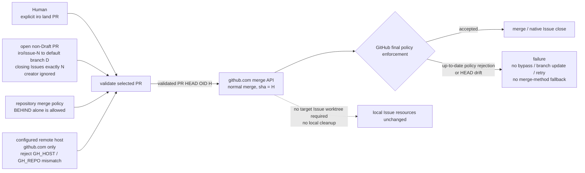
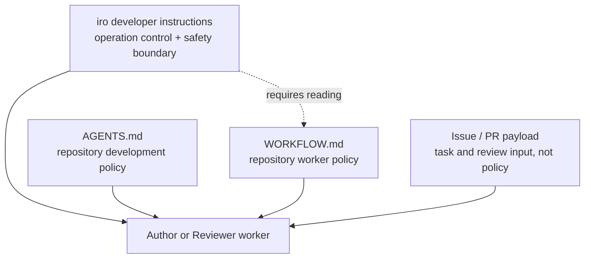

# iro Architecture

> 現在 architecture の non-normative diagrams。runtime requirement の正本は `docs/behavior.md` だけである。

## Authority and durable state

## Remote delivery lifecycle

## Canonical delivery relation

## Local workspace responsibilities

## Review snapshot provenance and opaque forwarding

## HEAD-bound Land on the configured host

## Instruction and policy layers

