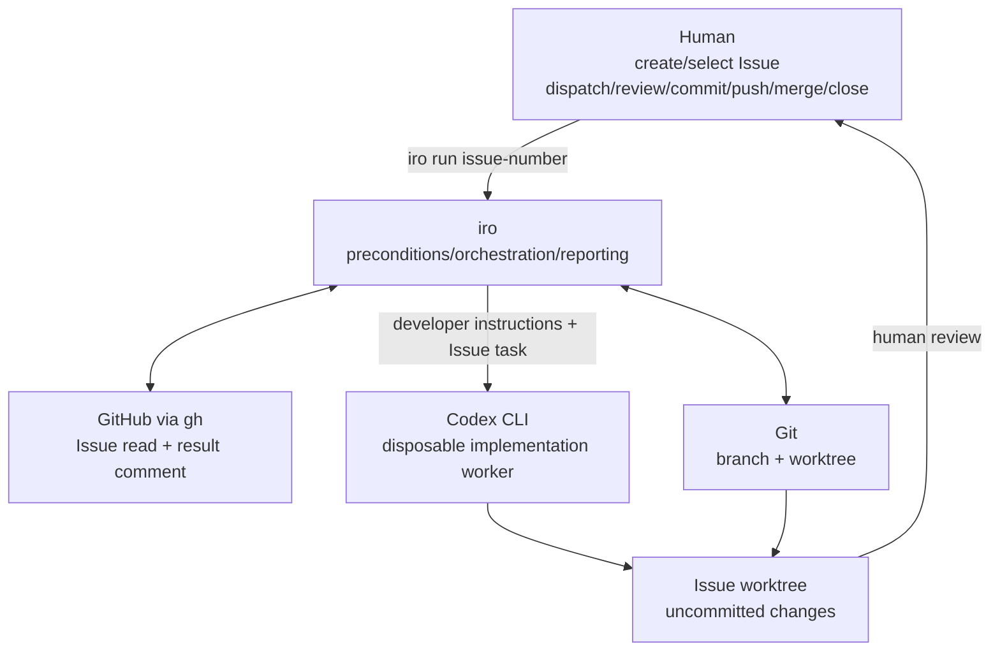
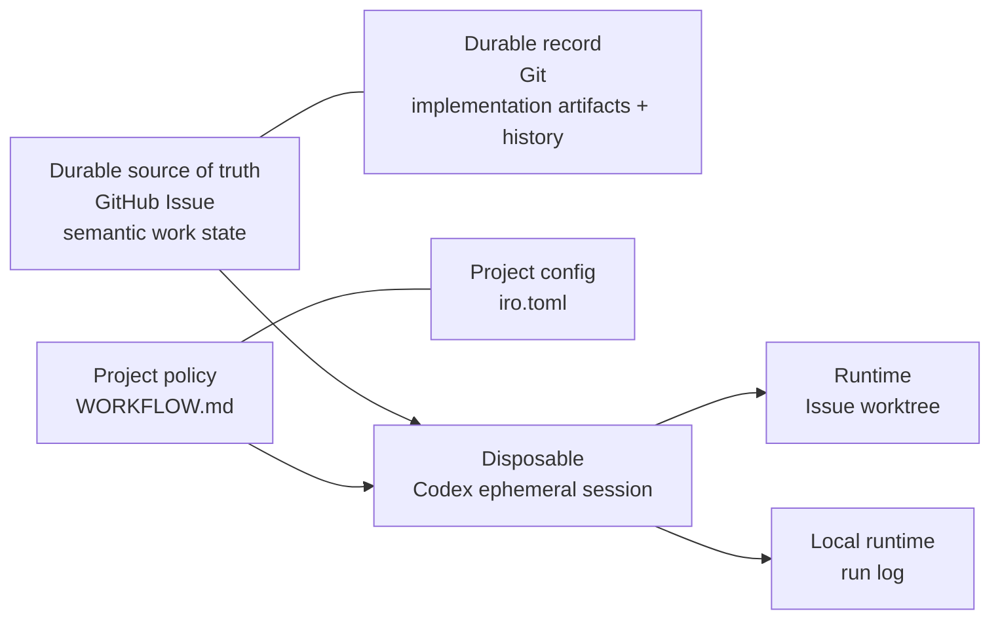
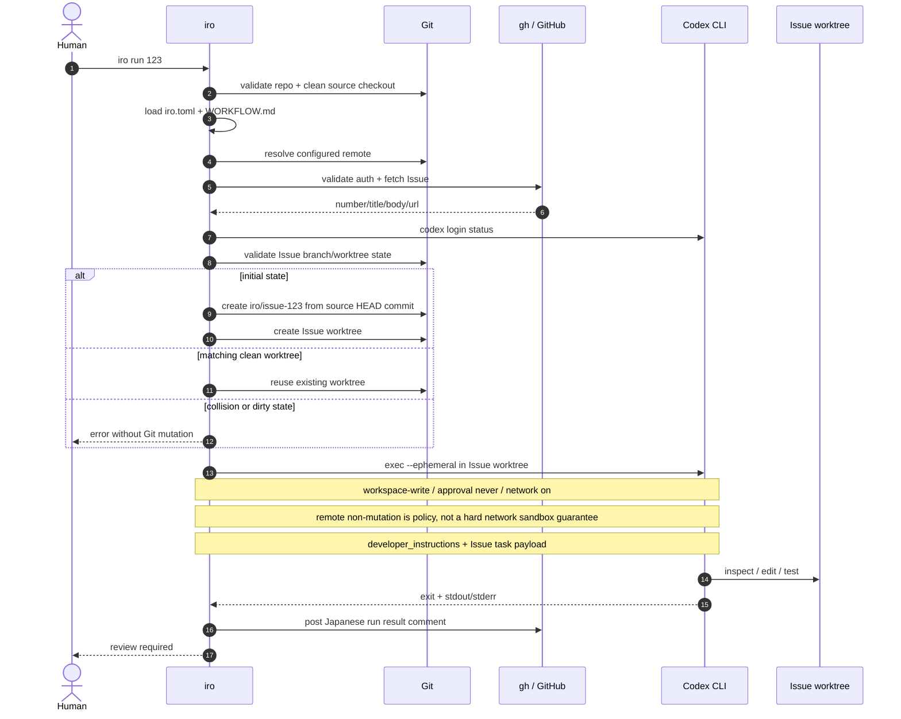
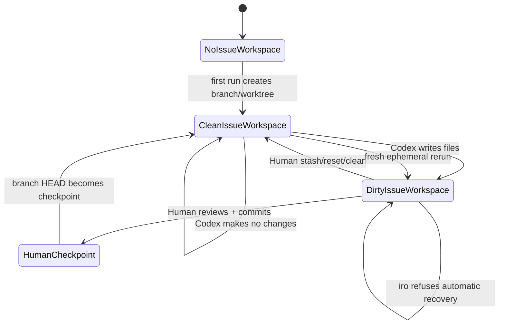
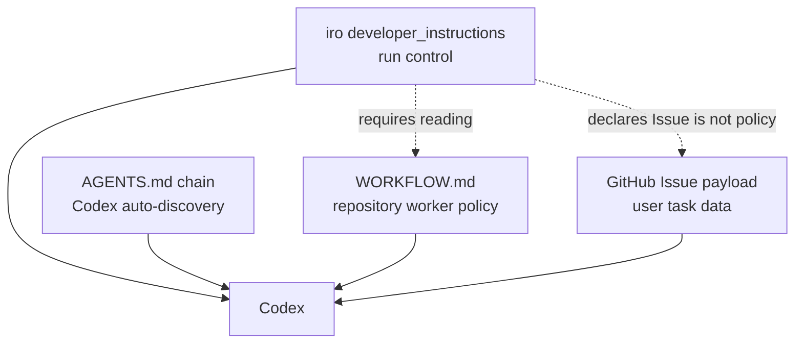

# iro Architecture

> Non-normative diagrams only. Runtime requirements are defined only by `docs/behavior.md`.

```mermaid
flowchart TB
    H[Human\ncreate/select Issue\ndispatch/review/commit/push/merge/close]
    I[iro\npreconditions/orchestration/reporting]
    GH[GitHub via gh\nIssue read + result comment]
    G[Git\nbranch + worktree]
    C[Codex CLI\ndisposable implementation worker]
    W[Issue worktree\nuncommitted changes]

    H -->|iro run issue-number| I
    I <--> GH
    I <--> G
    I -->|developer instructions + Issue task| C
    C --> W
    G --> W
    W -->|human review| H
```

```mermaid
flowchart LR
    D1[Durable source of truth\nGitHub Issue\nsemantic work state]
    D2[Durable record\nGit\nimplementation artifacts + history]
    P1[Project policy\nWORKFLOW.md]
    P2[Project config\niro.toml]
    R1[Disposable\nCodex ephemeral session]
    R2[Runtime\nIssue worktree]
    R3[Local runtime\nrun log]

    D1 --- D2
    P1 --- P2
    D1 --> R1
    P1 --> R1
    R1 --> R2
    R1 --> R3
```

```mermaid
sequenceDiagram
    autonumber
    actor Human
    participant IRO as iro
    participant Git as Git
    participant GH as gh / GitHub
    participant Codex as Codex CLI
    participant WS as Issue worktree

    Human->>IRO: iro run 123
    IRO->>Git: validate repo + clean source checkout
    IRO->>IRO: load iro.toml + WORKFLOW.md
    IRO->>Git: resolve configured remote
    IRO->>GH: validate auth + fetch Issue #123
    GH-->>IRO: number/title/body/url
    IRO->>Codex: codex login status
    IRO->>Git: validate Issue branch/worktree state

    alt initial state
        IRO->>Git: create iro/issue-123 from source HEAD commit
        IRO->>Git: create Issue worktree
    else matching clean worktree
        IRO->>Git: reuse existing worktree
    else collision or dirty state
        IRO-->>Human: error without Git mutation
    end

    IRO->>Codex: exec --ephemeral in Issue worktree
    Note over IRO,Codex: workspace-write / approval never / network on
    Note over IRO,Codex: remote non-mutation is policy, not a hard network sandbox guarantee
    Note over IRO,Codex: developer_instructions + Issue task payload
    Codex->>WS: inspect / edit / test
    Codex-->>IRO: exit + stdout/stderr
    IRO->>GH: post Japanese run result comment
    IRO-->>Human: review required
```

```mermaid
stateDiagram-v2
    [*] --> NoIssueWorkspace
    NoIssueWorkspace --> CleanIssueWorkspace: first run creates branch/worktree
    CleanIssueWorkspace --> DirtyIssueWorkspace: Codex writes files
    CleanIssueWorkspace --> CleanIssueWorkspace: Codex makes no changes
    DirtyIssueWorkspace --> HumanCheckpoint: Human reviews + commits
    HumanCheckpoint --> CleanIssueWorkspace: branch HEAD becomes checkpoint
    DirtyIssueWorkspace --> CleanIssueWorkspace: Human stash/reset/clean
    CleanIssueWorkspace --> DirtyIssueWorkspace: fresh ephemeral rerun
    DirtyIssueWorkspace --> DirtyIssueWorkspace: iro refuses automatic recovery
```

```mermaid
flowchart TB
    DI[iro developer_instructions\nrun control]
    AG[AGENTS.md chain\nCodex auto-discovery]
    WF[WORKFLOW.md\nrepository worker policy]
    IS[GitHub Issue payload\nuser task data]
    CX[Codex]

    DI --> CX
    AG --> CX
    WF --> CX
    IS --> CX

    DI -. requires reading .-> WF
    DI -. declares Issue is not policy .-> IS
```
