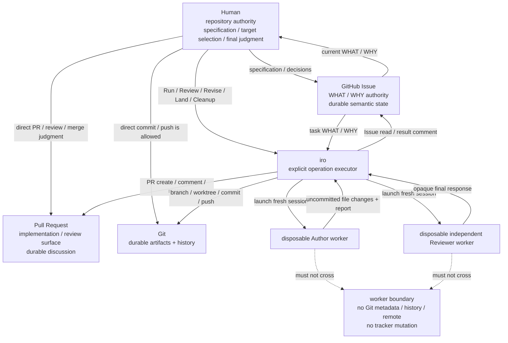
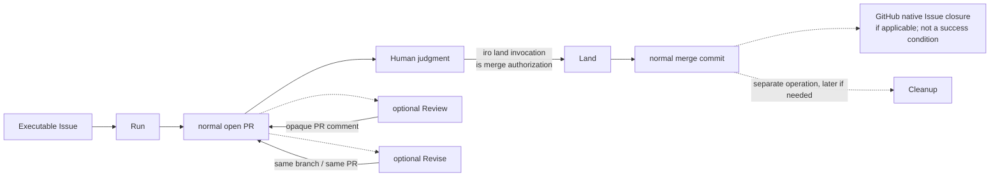
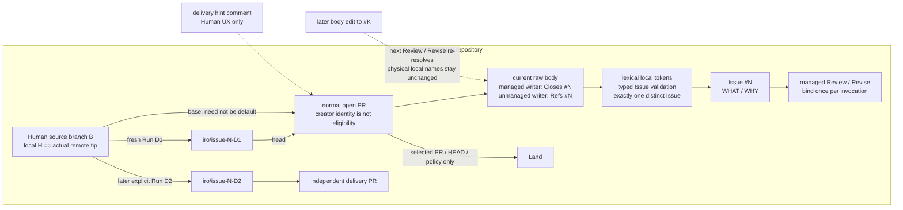
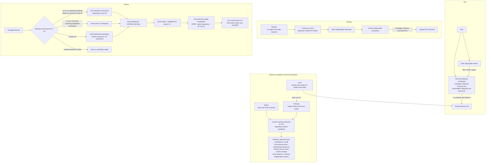
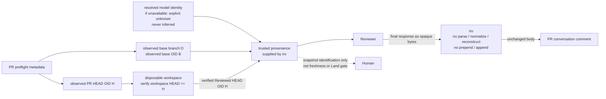
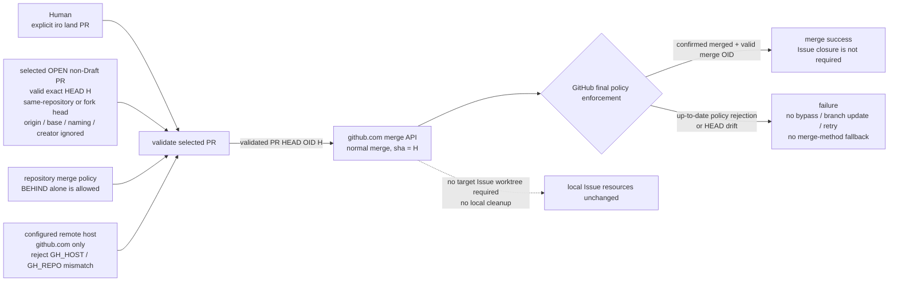
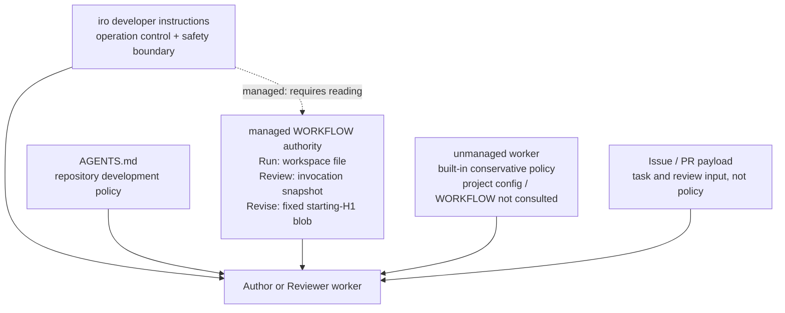

# iro Architecture

> 現在 architecture の non-normative diagrams。runtime requirement の正本は `docs/behavior.md` だけである。

GitHub + Codex の #83 foundation baseline を示す。Run の delivery identity、Review / Revise の specification binding、Land の merge integrity、Cleanup の physical namespace は別の責務である。

managed Run / Review / Revise / Land は config 読み込み後の小さな `tracker.type` switch から concrete GitHub operation へ入る。worker caller は `agent.type` から選択した concrete Codex runtime を使い、unmanaged は built-in `codex` 選択を使う。Land に agent dependency はなく、Status / Cleanup に selector / network dependency はない。これは #105 の behavior-preserving wiring であり、Gitea / Copilot support や共通 Tracker / Agent semantic interface は含まない。

## Authority and durable state

```mermaid
flowchart TB
    H["Human<br/>repository authority<br/>specification / target selection / final judgment"]
    ISSUE["GitHub Issue<br/>WHAT / WHY authority<br/>durable semantic state"]
    PR["Pull Request<br/>implementation / review surface<br/>durable discussion"]
    GIT["Git<br/>durable artifacts + history"]
    IRO["iro<br/>explicit operation executor"]
    AUTHOR["disposable Author worker"]
    REVIEWER["disposable independent Reviewer worker"]
    BOUNDARY["worker boundary<br/>no Git metadata / history / remote<br/>no tracker mutation"]

    H -->|"specification / decisions"| ISSUE
    ISSUE -->|"current WHAT / WHY"| H
    H -->|"Run / Review / Revise / Land / Cleanup"| IRO
    H -->|"direct commit / push is allowed"| GIT
    H -->|"direct PR / review / merge judgment"| PR
    ISSUE -->|"task WHAT / WHY"| IRO
    IRO -->|"launch fresh session"| AUTHOR
    IRO -->|"launch fresh session"| REVIEWER
    AUTHOR -->|"uncommitted file changes + report"| IRO
    REVIEWER -->|"opaque final response"| IRO
    AUTHOR -.->|"must not cross"| BOUNDARY
    REVIEWER -.->|"must not cross"| BOUNDARY
    IRO -->|"Issue read / result comment"| ISSUE
    IRO -->|"PR create / comment / merge"| PR
    IRO -->|"branch / worktree / commit / push"| GIT
```

## Remote delivery lifecycle

```mermaid
flowchart LR
    ISSUE["Executable Issue"] --> RUN["Run"]
    RUN --> PR["normal open PR"]
    PR --> HUMAN["Human judgment"]
    PR -.-> REVIEW["optional Review"]
    REVIEW -->|"opaque PR comment"| PR
    PR -.-> REVISE["optional Revise"]
    REVISE -->|"same branch / same PR"| PR
    HUMAN -->|"iro land invocation<br/>is merge authorization"| LAND["Land"]
    LAND --> MERGE["normal merge commit"]
    MERGE -.-> CLOSE["GitHub native Issue closure<br/>if applicable; not a success condition"]
    MERGE -.->|"separate operation, later if needed"| CLEANUP["Cleanup"]
```

## Independent delivery と raw-body specification binding

```mermaid
flowchart LR
    subgraph REPO["selected GitHub repository"]
        B["Human source branch B<br/>local H == actual remote tip"]
        D1["iro/issue-N-D1"]
        D2["iro/issue-N-D2"]
        PR["normal open PR<br/>creator identity is not eligibility"]
        ISSUE["Issue #N<br/>WHAT / WHY"]

        B -->|"fresh Run D1"| D1
        B -->|"later explicit Run D2"| D2
        D1 -->|"head"| PR
        D2 --> OTHER["independent delivery PR"]
        B -->|"base; need not be default"| PR
        PR --> BODY["current raw body<br/>managed writer: Closes #N<br/>unmanaged writer: Refs #N"]
        BODY --> RESOLVE["lexical local tokens<br/>typed Issue validation<br/>exactly one distinct Issue"]
        RESOLVE --> ISSUE
        ISSUE --> CONSUMER["managed Review / Revise<br/>bind once per invocation"]
        PR -->|"selected PR / HEAD / policy only"| LAND["Land"]
    end

    HINT["delivery hint comment<br/>Human UX only"] -.-> PR
    EDIT["later body edit to #K"] -.->|"next Review / Revise re-resolves<br/>physical local names stay unchanged"| BODY
```

## Local workspace responsibilities

```mermaid
flowchart TB
    subgraph RUNPATH["Run"]
        RUN["Run"] --> CWS["fresh per-delivery workspace<br/>managed: attached iro/issue-N-D<br/>unmanaged: detached run-issue-N-D"]
        RUN --> AW["fresh disposable Author"]
        AW -->|"files / tests / report"| CWS
        CWS -->|"iro commits and delivers"| REMOTEPR["remote delivery PR"]
    end

    subgraph REVIEWPATH["Review"]
        REVIEW["Review<br/>no target local state required"] --> TMP["temporary clone<br/>detached verified PR HEAD"]
        TMP --> RW["fresh independent Reviewer"]
        RW --> REMOVE["remove disposable workspace"]
        REMOVE -->|"managed: cleanup succeeds first"| COMMENT["opaque PR comment"]
    end

    subgraph REVISEPATH["Revise"]
        REVISE["managed Revise"] --> LOCAL{"selected exact head ref F / H1"}
        LOCAL -->|"iro ref; no attached worktree<br/>absent or exact-H1 local ref"| MATERIALIZE["fresh attached workspace<br/>materialize exact H1"]
        LOCAL -->|"iro ref; one clean<br/>matching registered workspace"| REUSE["reuse exact F workspace"]
        LOCAL -->|"Human ref"| DETACH["fresh detached workspace<br/>Human checkout / ref untouched"]
        LOCAL -->|"unsafe selected iro state"| STOP["stop; no automatic repair"]
        MATERIALIZE --> POLICY["fixed starting-H1 WORKFLOW blob"]
        REUSE --> POLICY
        DETACH --> POLICY
        POLICY --> CHILD["fresh Author / validated H1-parent C1"]
        CHILD --> RECHECK["one push-time target revalidation<br/>OPEN / same repository + ref / tip H1"]
        RECHECK --> PUSH["one normal push to F<br/>final read to push race accepted"]
    end

    subgraph FINISHPATH["Remote completion and local teardown"]
        LAND["Land<br/>remote-only relative to target Issue state"] --> REMOTEPR
        STATUS["Status<br/>read-only local inventory"] --> INVENTORY["current-common-directory iro refs<br/>registered runtime worktrees"]
        CLEANUP["Cleanup<br/>explicit destructive local purge"] --> INVENTORY
        INVENTORY --> ORDER["Cleanup: physical Issue namespace or bulk<br/>force-remove dirty / unpublished resources<br/>remove known exact runtime residue<br/>verify absence; continue independent actions"]
    end

    LAND -.->|"does not run"| CLEANUP
```

Status / Cleanup は current common directory の登録と ref だけを発見元にする。ordinary detached worktree、別 common directory、未登録 filesystem-only residue を名前の類似や remote provenance から採用・発見しない。v1 ownership JSON は authority でも migration source でもない。

unmanaged Review / Revise は毎回 fresh detached linked worktree を使う。unmanaged Review は opaque comment の一度の試行後に teardown し、unmanaged Run / Revise は confirmed delivery 後に teardown する。failure / unknown の保持と cleanup warning の扱いは command ごとの behavior specification に従う。

## Review snapshot provenance and opaque forwarding

```mermaid
flowchart LR
    META["PR preflight metadata"] --> BASE["observed base branch D<br/>observed base OID B"]
    META --> HEAD["observed PR HEAD OID H"]
    HEAD --> VERIFY["disposable workspace<br/>verify workspace HEAD == H"]
    MODEL["resolved model identity<br/>if unavailable: explicit unknown<br/>never inferred"] --> TRUST["trusted provenance<br/>supplied by iro"]
    BASE --> TRUST
    VERIFY -->|"verified Reviewed HEAD OID H"| TRUST
    TRUST --> REVIEWER["Reviewer"]
    REVIEWER -->|"final response as opaque bytes"| IRO["iro<br/>no parse / normalize / reconstruct<br/>no prepend / append"]
    IRO -->|"unchanged body"| COMMENT["PR conversation comment"]
    TRUST -.->|"snapshot identification only<br/>not freshness or Land gate"| HUMAN["Human"]
```

## HEAD-bound Land on the configured host

```mermaid
flowchart LR
    HUMAN["Human<br/>explicit iro land PR"] --> VALIDATE["validate selected PR"]
    REL["selected OPEN non-Draft PR<br/>valid exact HEAD H<br/>same-repository or fork head<br/>origin / base / naming / creator ignored"] --> VALIDATE
    POLICY["repository merge policy<br/>BEHIND alone is allowed"] --> VALIDATE
    HOST["configured remote host<br/>github.com only<br/>reject GH_HOST / GH_REPO mismatch"] --> VALIDATE
    VALIDATE -->|"validated PR HEAD OID H"| API["github.com merge API<br/>normal merge, sha = H"]
    API --> GITHUB{"GitHub final policy enforcement"}
    GITHUB -->|"confirmed merged + valid merge OID"| MERGED["merge success<br/>Issue closure is not required"]
    GITHUB -->|"up-to-date policy rejection<br/>or HEAD drift"| FAILURE["failure<br/>no bypass / branch update / retry<br/>no merge-method fallback"]
    API -.->|"no target Issue worktree required<br/>no local cleanup"| LOCAL["local Issue resources unchanged"]
```

この図は managed Land を示す。unmanaged Land は origin identity を使い、same-repository head を要求する。両 mode とも merge response が不明なら non-success とし、remote 確認を Human に委ねて retry / fallback / repair をしない。

## Instruction and policy layers

```mermaid
flowchart TB
    DI["iro developer instructions<br/>operation control + safety boundary"]
    AG["AGENTS.md<br/>repository development policy"]
    WF["managed WORKFLOW authority<br/>Run: workspace file<br/>Review: invocation snapshot<br/>Revise: fixed starting-H1 blob"]
    BUILTIN["unmanaged worker<br/>built-in conservative policy<br/>project config / WORKFLOW not consulted"]
    TASK["Issue / PR payload<br/>task and review input, not policy"]
    WORKER["Author or Reviewer worker"]

    DI --> WORKER
    AG --> WORKER
    WF --> WORKER
    BUILTIN --> WORKER
    TASK --> WORKER
    DI -.->|"managed: requires reading"| WF
```

managed identity は configured `tracker.remote`、unmanaged identity は `origin` から解決する。consumer の eligibility は invocation の mode ごとに独立して検査し、producer の mode / policy / local log を権限として継承しない。
